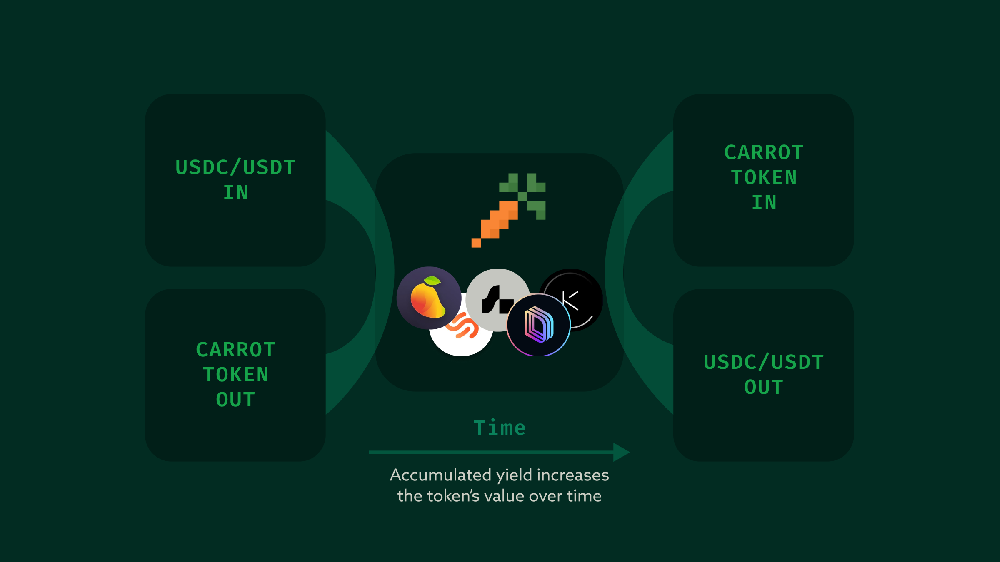

# jup-carrot-implementation

Carrot Protocol Integration with Jupiter Router

## What is Carrot?

Carrot is the easiest way to passively benefit from DeFi on Solana. We've crafted a single token that allows you to accrue the highest average yield across the Solana DeFi landscape. By continually monitoring every lending protocol, we rebalance funds whenever there is a more optimal rate available. Carrot ensures your stablecoins capture higher APRs quicker, optimizing your returns efficiently and effectively.

### TODO

- strategy integration
- testing:
  - USDT, PYUSD
  - management, performance fee

#### Questions

- what do I put for fee mint?
